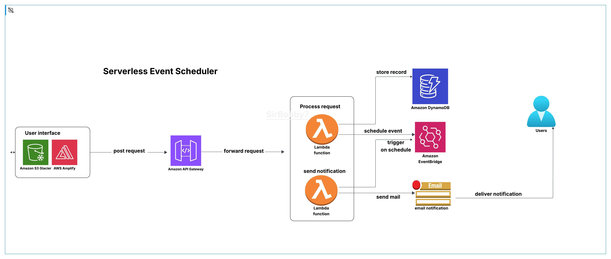
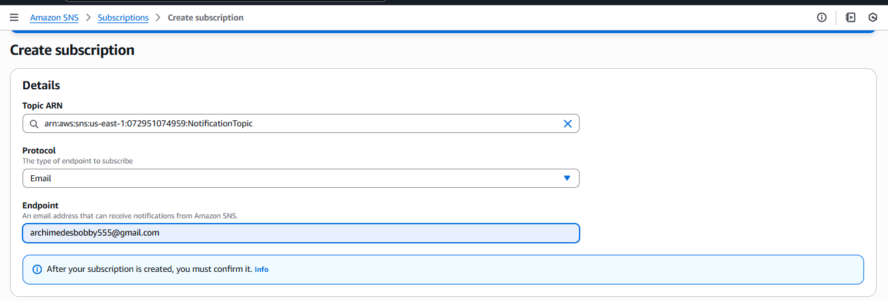
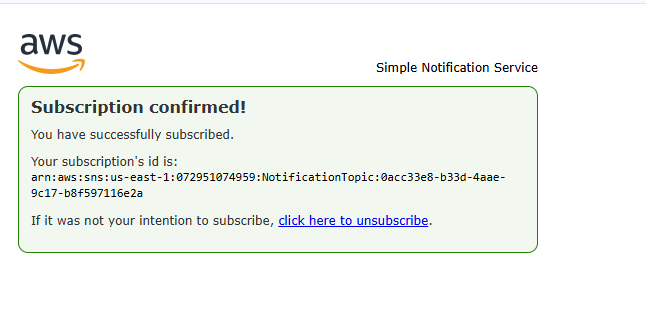
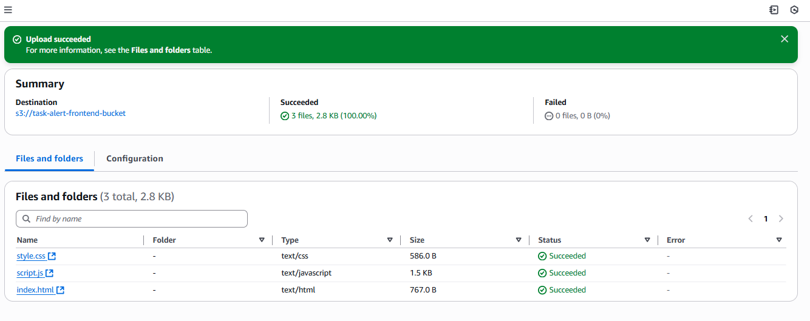
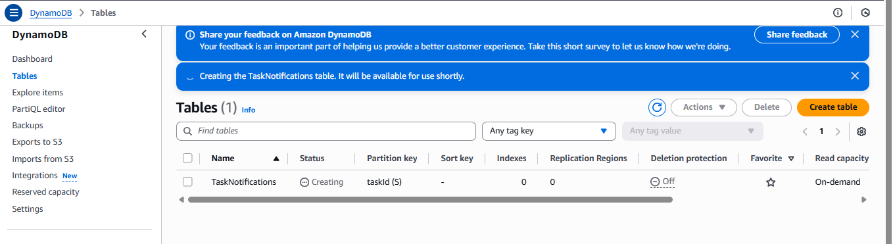
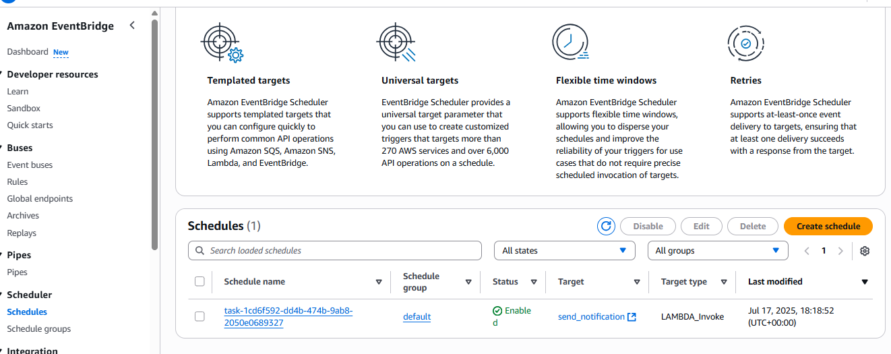
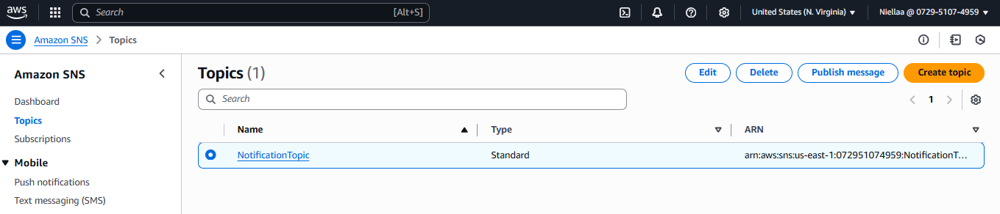
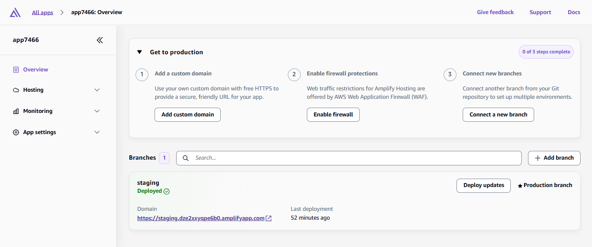
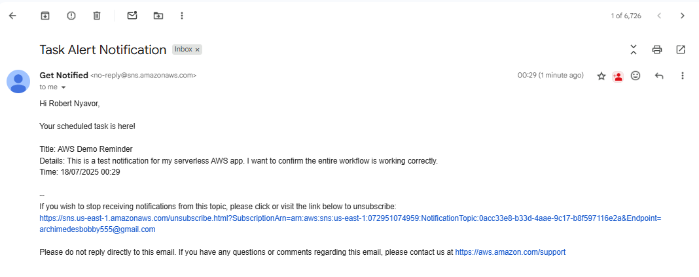
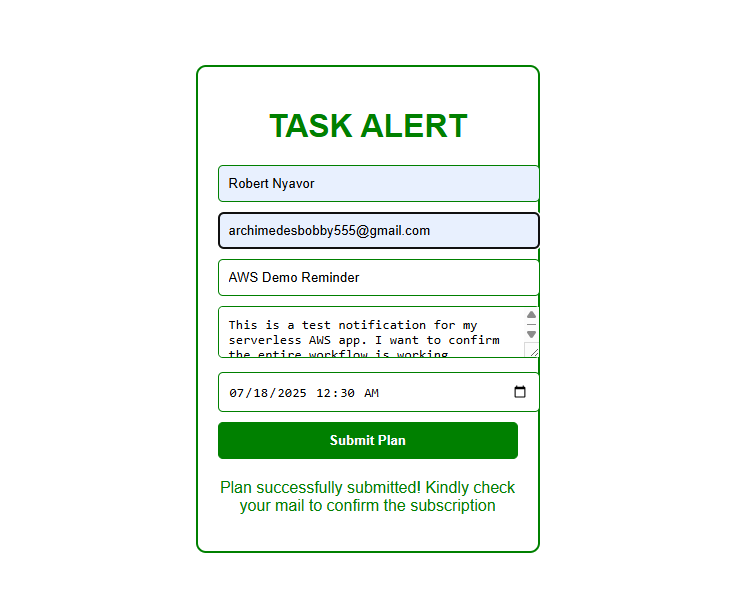

~Serverless Email Notification Alert System (AWS)

A serverless system that sends task reminders via email using:
- AWS Lambda
- Amazon SNS
- DynamoDB
- Amazon EventBridge Scheduler
- S3/Amplify for frontend hosting

~Problem Statement:

In our increasingly busy world, people often struggle to keep track of important tasks, deadlines, or commitments especially when those tasks need to be remembered at a specific future time. Traditional calendar apps or to-do lists require manual follow-ups and constant checking, which is prone to human error.

This project solves that problem by offering an automated serverless notification alert system that allows users to:

1. Schedule a reminder (via a simple form)

2. Automatically store the task 

3. Set a future execution time

4. Receive an email notification at the exact time specified

All of this is achieved without managing servers, without worrying about infrastructure, and with guaranteed delivery through AWS's reliable services. 
This project is cost-effective solution to ensure users never miss a task or deadline again. It's ideal for student reminders, medication alerts, task scheduling for remote teams, etc.

***

~Project Structure
1. Frontend: Form to submit tasks
2. Two lambda functions: `send_notification`: Sends email using SNS
                         `lambda/process_event`: processes requests & stores form data in DynamoDB
3. `eventbridge`: Scheduler configuration

~Architecture Diagram

4. IAM Policies
Attached AWS managed policies with least priveledge to the Lambda execution role

5. Confirmed SNS Email Subscriptions
All recipients were confirmed on the SNS topic for email delivery to succeed

6. Task ID Handling
Ensured the HTML form, process_event Lambda, and DynamoDB record included taskId correctly to be used as an identifier

7. No Errors in Lambda Logs
Checked CloudWatch Logs for both Lambda functions to confirm successful invocations and no runtime errors

~How It Works

1. User submits a task via the form (name, email, task details, time)

2. process_event Lambda processes & stores the task in DynamoDB

3. An EventBridge Scheduler rule is automatically created to trigger the send_notification Lambda function at the specified time

4. send_notification lambda function reads the task from DynamoDB and sends an email notification via SNS

, , , 
, , , , , , 

~Contributions

Pull requests are welcome! Feel free to raise an issue first for discussion.

Thanks for visiting this repo! :)

Best regards,

Robert Nyavor
